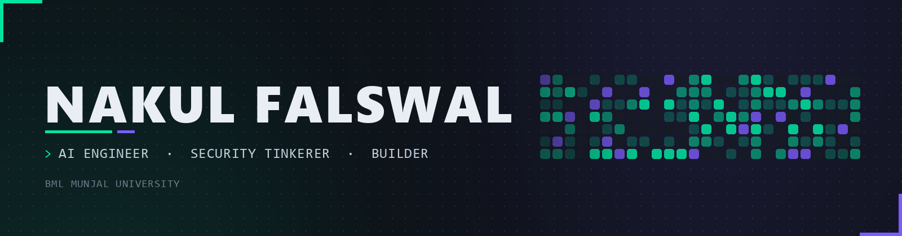
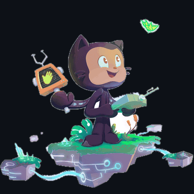
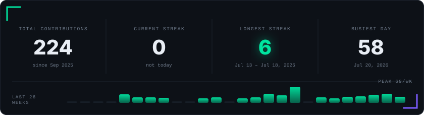
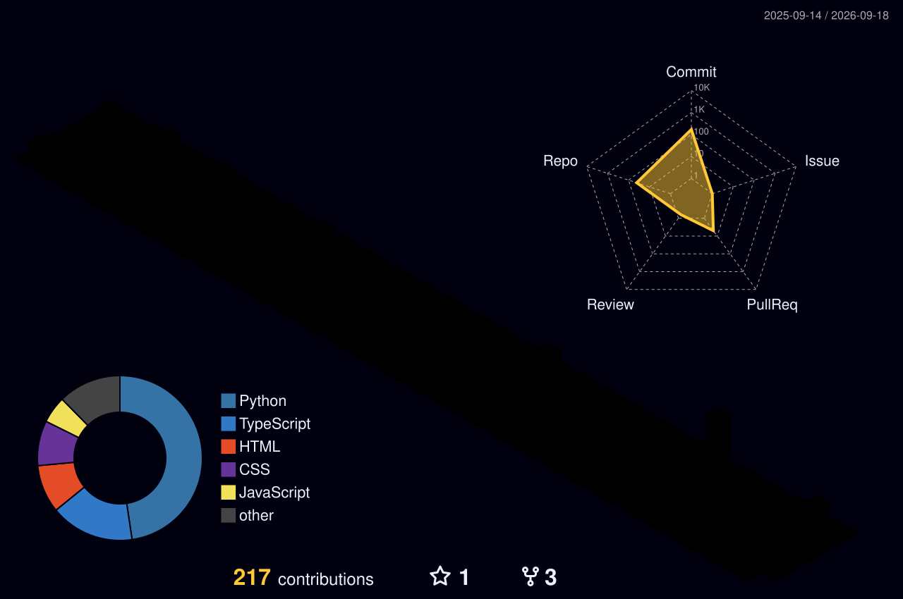
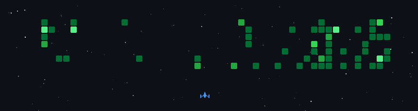

<!--
  ═══════════════════════════════════════════════════════════════════════════
   Nakul Falswal · github.com/lukan-lawslaf · profile README
  ───────────────────────────────────────────────────────────────────────────

   Images under ./assets/ are generated by tools/*.py and are already here.
   Images under ./profile/ and ./profile-3d-contrib/, plus game.gif, appear
   only after the GitHub Actions have run once. Also SETUP.md.
  ═══════════════════════════════════════════════════════════════════════════
-->

<picture>
  <source media="(prefers-color-scheme: dark)" srcset="./assets/header.png" />
  <source media="(prefers-color-scheme: light)" srcset="./assets/header-light.png" />
  
</picture>

 

<picture>
  <source media="(prefers-color-scheme: dark)" srcset="./assets/hero.gif" />
  <source media="(prefers-color-scheme: light)" srcset="./assets/hero-light.gif" />
  
</picture>

### ▌ Who-Am-I?

I'm a CS undergrad at **BML Munjal University**. Most of what I build sits at the seam
between a language model and something real — a one-line prompt that comes back as a
bookable itinerary, a novel that comes back as an audiobook with a different voice for
every character, a pasted snippet that comes back patched.

The other half of it is the paranoid half. I like reading code the way an attacker would,
which is where **VibeSec** came from: a pipeline that finds the vulnerability *and* ships
the fix, instead of handing you a 40-page PDF and wishing you luck.

Lately I've been going the other direction too — instead of calling a model, building one.
**littleMl** is a 25.6M-parameter transformer with every layer typed out by hand, trained on
my own laptop until it learned English. The first 24-hour run was silently broken and every
metric said it was fine, which taught me more than the run that worked.

Thirty-nine repos in, the pattern is clear enough — I'd rather have a rough thing running
tonight than a clean thing scheduled for next month.

&nbsp;&nbsp;**Building** &nbsp;·&nbsp; [littleMl](https://github.com/lukan-lawslaf/littleMl), [VibeSec](https://github.com/lukan-lawslaf/VibeSec) and [Novelcast](https://github.com/lukan-lawslaf/Novelcast)
 &nbsp;&nbsp;**Learning** &nbsp;·&nbsp; agent orchestration, post-quantum crypto, Flutter
 &nbsp;&nbsp;**Ask me about** &nbsp;·&nbsp; LLM pipelines, prompt injection, training a model on one GPU, why two of my repos end in a hyphen
 &nbsp;&nbsp;**Fun fact** &nbsp;·&nbsp; I have the YOLO badge. I merged without review. I'd do it again.

 

### ▌ what I build with

The eight I actually open every day:

  
  
  
  
  
  
  
  

And the rest of it:

<table>
<tr>
<td valign="top" width="50%">

**Languages**

</td>
<td valign="top" width="50%">

**AI / ML**

OpenAI&nbsp;·&nbsp;Anthropic&nbsp;·&nbsp;Gemini&nbsp;·&nbsp;LangChain&nbsp;·&nbsp;Hugging&nbsp;Face

</td>
</tr>
<tr>
<td valign="top" width="50%">

**Frameworks**

</td>
<td valign="top" width="50%">

**Data · Infra · Security**

Burp&nbsp;Suite&nbsp;·&nbsp;Wireshark&nbsp;·&nbsp;nmap&nbsp;·&nbsp;OWASP&nbsp;ZAP

</td>
</tr>
</table>

### ▌ things I've shipped

<table>
<tr>
<td width="50%" valign="top">

#### [VibeSec](https://github.com/lukan-lawslaf/VibeSec)

An AI security pipeline that doesn't just *find* vulnerabilities — it patches them. Feed it
a snippet, a repo URL or a live endpoint, get working fixed code back.

`TypeScript` `·` `LLM` `·` `SAST`

</td>
<td width="50%" valign="top">

#### [TRIP-AI](https://github.com/lukan-lawslaf/TRIP-AI)

One sentence in, a whole trip out — flights, hotels, trains, food and maps stitched into an
itinerary you can actually follow.

`Python` `·` `Agents` `·` `Maps API`

</td>
</tr>
<tr>
<td width="50%" valign="top">

#### [Novelcast](https://github.com/lukan-lawslaf/Novelcast)

Turns a novel into a living audiobook, casting a distinct voice for every character instead
of one flat narrator.

`TypeScript` `·` `TTS` `·` `Voice cloning`

</td>
<td width="50%" valign="top">

#### [Lodestone](https://github.com/lukan-lawslaf/Lodestone-)

A study companion with a spine. It sharpens how a student reasons through a problem rather
than handing over the answer.

`Python` `·` `Socratic prompting`

</td>
</tr>
<tr>
<td width="50%" valign="top">

#### [orbital](https://github.com/lukan-lawslaf/orbital)

What's happening in space *right now* — live orbital activity, rendered in the browser.

`TypeScript` `·` `Real-time` `·` `Space APIs`

</td>
<td width="50%" valign="top">

#### [Echo](https://github.com/lukan-lawslaf/Echo-All-in-one-Discord-bot-)

One Discord bot instead of six: it talks, generates images, makes video, and keeps going.

`Python` `·` `Multimodal` `·` `discord.py`

</td>
</tr>
<tr>
<td width="50%" valign="top">

#### [littleMl](https://github.com/lukan-lawslaf/littleMl)

A 25.6M-parameter language model written from scratch — no `transformers`, no pretrained
anything. Fifteen hours on my laptop GPU until it learned to write English. Fits an ESP32-S3
in 12 MB.

`PyTorch` `·` `RoPE + SwiGLU` `·` `from scratch`

</td>
<td width="50%" valign="top">

&nbsp;

</td>
</tr>
</table>

→ &nbsp;[**the other thirty-two**](https://github.com/lukan-lawslaf?tab=repositories)

### ▌ receipts

<!-- stats.svg / top-langs.svg are rendered into this repo by
     .github/workflows/stats-cards.yml, so no third-party server can break them. -->

  
  

<!-- streak.svg is drawn by tools/make_cards.py straight from the contributions
     API — the usual streak widget is a third party that is currently down. -->
<picture>
  <source media="(prefers-color-scheme: dark)" srcset="./profile/streak.svg" />
  <source media="(prefers-color-scheme: light)" srcset="./profile/streak-light.svg" />
  
</picture>

&nbsp;<b>the trophy shelf</b>

 

### ▌ my contribution graph, but as a game

A snake eats a year of my commits. Regenerated nightly by
[Platane/snk](https://github.com/Platane/snk).

<picture>
  <source media="(prefers-color-scheme: dark)" srcset="https://raw.githubusercontent.com/lukan-lawslaf/lukan-lawslaf/output/github-contribution-grid-snake-dark.svg" />
  <source media="(prefers-color-scheme: light)" srcset="https://raw.githubusercontent.com/lukan-lawslaf/lukan-lawslaf/output/github-contribution-grid-snake.svg" />
  
</picture>

&nbsp;<b>the same graph as an isometric city</b>

 

&nbsp;<b>the same graph as a Galaga clone</b>

 

Denser commit days spawn tougher enemies. Some weeks I was clearly outgunned.

### ▌ say hi

Got an idea that sounds slightly unreasonable? Those are my favourite kind.

&nbsp;

&nbsp;

  

<i>"Ship it, then read the security advisory." — me, regrettably</i>

  

